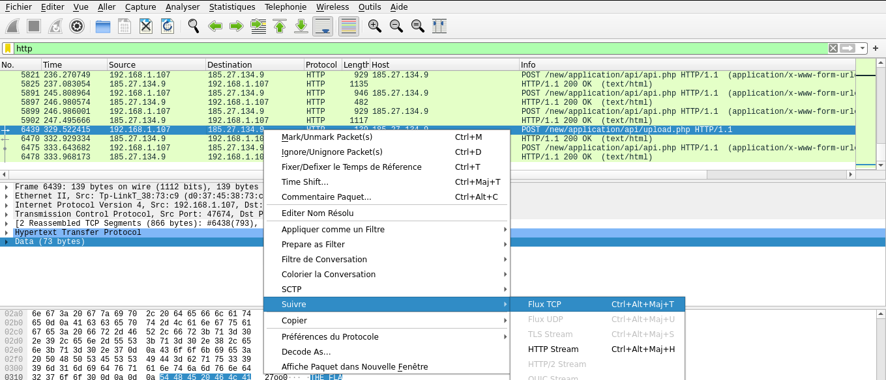
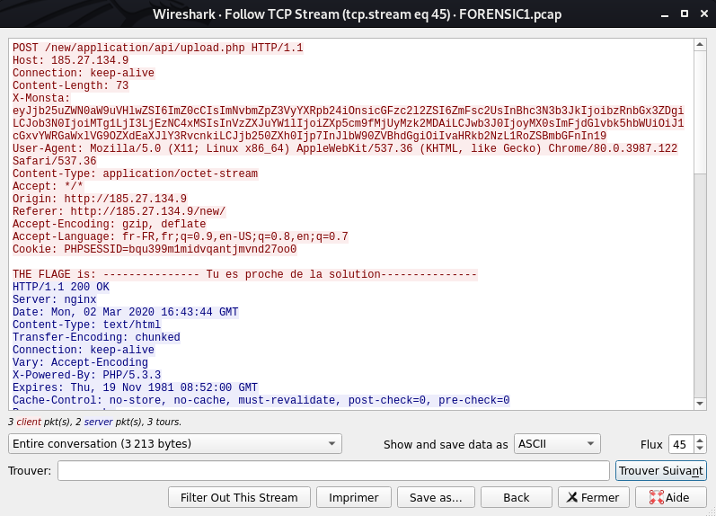
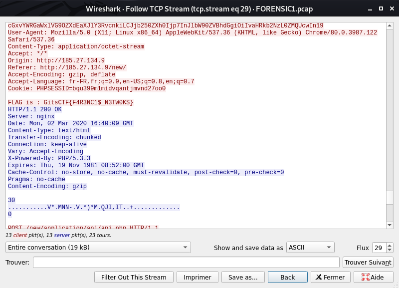

# Challenges - GitsCTF

## D33ply challenge -- Cryptographie

En passant le code dans l'outils cyberchef on obtient un code binaire:

Une fois décodé on obtient le flag : `GitsCTF{} `

## FTP Stuck Challenge -- Forensic

Nous avons un fichier pcap nommé FORENSIC1.pcap

Nous devons retrouvé la trace d'un fichier uploader pour trouver le flag.

J'ai commencé par filtrer les packets suivant le protocol http. En parcourant les packets obtenus, on trouve un fichier nommé upload.php .

En suivant le flux tcp on obtient : 

En évoulant flux par flux on trouve le flag dans le flux du packet n° 29 : `GitsCTF{F4R3NC1$_N3TW0KS}`.

